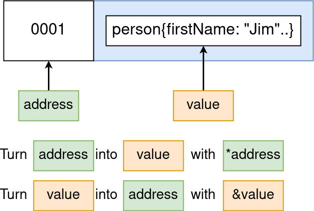

# Go Course

These are my notes about the Go: The Complete Developers Guide (Golang) course
on Udemy:

* https://www.udemy.com/course/go-the-complete-developers-guide

## Using vim for editor

Using vim to set up:

* install vim-go: https://github.com/fatih/vim-go
  * install the plugin (Vim8): 
    ```
    git clone https://github.com/fatih/vim-go.git ~/.vim/pack/plugins/start/vim-go
    ```
  * run the install: `:GoIinstallBinaries`

### Autocompletion

`vim-go` will autocomplete by using 

```
<C-x><C-o>
```

## Code Style

Go code style is strictly enforced and can be automatically cleaned up with:
```
go fmt
```

## Coursework Repo

# Project 1: Card Deck

## Compiling Go

```
go run main.go deck.go
```
runs both modules as they are both part of the `main` package

### Creating executeables

the `main` package will create an executeable. All other packages will not
create an executeable

so 

```
package apple

import (
    "fmt"
)

func main() {
    fmt.Println("Hello World")
}
```
will not create an executeable when compiled with `go build main.go`

## Creating types

```
type deck []string
```
creates a type called `deck` which will behave like `[]string`, much like a
subclass so we can use it like

```
deck{"One", "Two", "Three"}
```

### Adding functionality to custom types

create a function with a **receiver** (in this case `(d deck)`

```
func (d deck) print() {
    for i, card := range d {
        fmt.Println(i, card)
    }
}
```

* `d` is from type `deck` which is set up as `[]string`. By convention, this is
  a one or two letter variable from the type
* it loops through a range, exposing `i` and `card`
* `range d` allows iterating over a range (like `[]string`

Links

* https://gobyexample.com/range
* https://gobyexample.com/for

## using ranges in slices

we can use the following to set a range from within a slice

```
slicename[upToAndIncluding:FromNotIncluding]
```

so the following are true

```
mySlice := []string {"Apple", "Banana", "Orange", "Grape"}

mySlice[0:2]
// returns {"Apple", "Banana"}

mySlice[:2]
// returns {"Apple", "Banana"}

mySlice[2:4]
// returns {"Orange", "Grape"}

mySlice[2:]
// returns {"Orange", "Grape"}
```

Notes:
* the first number in the range is "from and **including**"
* the first number can be omitted to infer from the start (0)
* the second number in the range is "up to and **not including**"
* the second number can be omitted to infer to the end (4 in this case)

so a single number can be used on either side of the colon to select 2 subsets
whose total is the whole set

```
mySlice := []string {"Apple", "Banana", "Orange", "Grape"} 


fmt.Println(mySlice[2:])
// returns {"Orange", "Grape"}

fmt.Println(mySlice[:2])
// returns {"Apple", "Banana"}
```

## multiple return values in a func

the following shows how we can return multiple values from a single function

```
func deal(d deck, handSize int) (deck, deck) {
    return d[:handSize], d[handSize:]
}

func main() {
    cards := newDeck()
    hand, remainingCards := deal(cards, 5)

    hand.print()
    remainingCards.print()
}
```

this function will take a deck and a handsize and split that deck into 2
separate decks, one with the handsize and one with the remaining cards in the
original deck. In the main func we create and assign the two return values to
`hand` and `remainingCards`. Phew!

## random numbers

Using random numbers from the `math/rand` package directly will result in the
same result every time the program is run. To make the random numbers **more**
random, create an instance of `rand` with a seed

```
func (d deck) shuffle() {
	// use number of nanoseconds since the epoch
	// as a seed for a new rand instance
	seed := time.Now().UnixNano()
	source := rand.NewSource(seed)
	r := rand.New(source)

	for i := range d {
		newPosition := r.Intn(len(d) - 1)

		d[i], d[newPosition] = d[newPosition], d[i]
	}
}
```

## output to console

using the `fmt` package we can use
* `Println` output list of arguments - very like `console.log()` in js
* `Printf` output with formatting tokens
  * `%v` value
  * `%+v` print out all keys and values from a struct

## structs

set up with a type with (or writhout) some fields

```
type person struct {
    firstName string
    lastName  string
}
```

can use nested structs

```
type contactInfo struct {
    email   string
    zip     int
}

type person struct {
    firstName string
    lastName  string
    contactInfo
}
```

notes:

* `contactInfo` is destructured here, so it means `contactInfo contactInfo`

methods can also be added to a struct by using the type in the receiver, making
it as close to a class as Golang gets

```
func (p person) getName() string {
    return p.lastName + ", " + p.firstName
}
```

#### repos

* https://github.com/overbyte/gostructs

## pointers and references

in the following function:

```
func main() {
	jim := person{
		firstName: "Jim",
		lastName:  "Cricket",
		contactInfo: contactInfo{
			email:   "jimminycrickey@gmail.com",
			zipCode: 12345,
		},
	}

	jimPointer := &jim
	jimPointer.updateName("Jimminy")
	jim.print()
}

func (pointerToPerson *person) updateFirstName(newFirstName string) {
    (*pointerToPerson).firstNameName = newFirstName
}
```

* `*person` is a type of "pointer to a person type"
* `(*pointerToPerson)` is a dereference of a pointer to an actual value
* `&jim` is a reference to the jim person

| Type      	| Description                                                  	|
|-----------	|--------------------------------------------------------------	|
| `&variable` 	| the memory address of the value this variable is pointing at 	|
| `*pointer`  	| the value of the memory address                              	|



so in the following example, the output will be `Bill` because we are converting
`name` into a memory address and immediately dereferencing that back into a
string value

```
package main
import "fmt"
func main() {
    name := "Bill"
    fmt.Println(*&name)
}
```

### Shortcut for using memory addresses

Golang will allow the developer to not worry about manually converting the value
into a memory address before using in a reference so the following works:

```
func main() {
	jim := person{
		firstName: "Jim",
		lastName:  "Cricket",
		contactInfo: contactInfo{
			email:   "jimminycrickey@gmail.com",
			zipCode: 12345,
		},
	}

	jim.updateName("Jimminy")
	jim.print()
}

func (pointerToPerson *person) updateFirstName(newFirstName string) {
    (*pointerToPerson).firstNameName = newFirstName
}
```

This is taking `jim` of type `person` and intrinsically converting the `person`
to a `*person` (pointer to person), making the code look less noddy. 

Importantly we must still use the type `*person` in our function declaration to
dereference it otherwise we will have a type mismatch `person` to `*person`

### Slices pass by reference

so even if we do the following, the slice will be updated `>,<`

```
func main() {
    mySlice := []int{0, 2, 3, 4, 5}
    updateSlice(mySlice)
    fmt.Println(mySlice) // outputs [1 2 3 4 5]
}

func updateSlice(s []int) {
    s[0] = 1
}
```

This is because, although the function does actually copy the slice, the slice
itself is a reference type (it points to an underlying array). The following
table shows which types are values and which are reference types

| Value Types   | Reference Types   |
|------------   |----------------   |
| int           | slice             |
| float         | map               |
| bool          | channel           |
| string        | pointer           |
| struct        | function          |

#### lectures

* https://www.udemy.com/course/go-the-complete-developers-guide/learn/lecture/7797348
* https://www.udemy.com/course/go-the-complete-developers-guide/learn/lecture/7797350

#### repos

* https://github.com/overbyte/gostructs

## maps

is a set of key/value pairs where the types of the keys and the values are
always the same

types of declaration

```
// these create empty maps
colors := make(map[string]string)
var colors = map[string]string

// this includes values
colors := map[string]string{
    "red": "#ff0000",
    "green": "#00ff00",
}
```

to access or mutate values within the map, we must always use the square
brackets

```
myColour := myMap["white"] // good
myColour := myMap.white // nope
```

This is because we need to match the type of the key

to remove k/v from a map use `delete(myMap, "thekey")

#### repos:

* https://github.com/overbyte/gomaps

## interfaces

Interfaces are simple contracts that mean that a type will implement all of
the methods defined on the interface. It can be used in place of the type, much
like an interface / superclass in OOP land.

note: there is no `implements` keyword in Golang; it is implied

```
type Writer interface {
    Write(p []byte) (n int, err error)
}

type logWriter struct{}

func (lw logWriter) Write(p []byte) (n int, err error) {
    // do something with p
    fmt.Println(string(p))

    // return correct value types
    return len(p), nil
}

func main() {
    res, err := http.Get("https://google.com")

    lw := logWriter
    io.Copy(lw, res.Body)
}
```

#### notes

* `res.Body` implements the `Reader` interface
* `lw` implements the `Writer` interface
* therefore we can use these in `io.Copy()` as the `Writer` and `Reader`
  * see https://golang.org/pkg/io/#Copy

#### repos

* https://github.com/overbyte/gointerfaces
* https://github.com/overbyte/gogooglescraper
