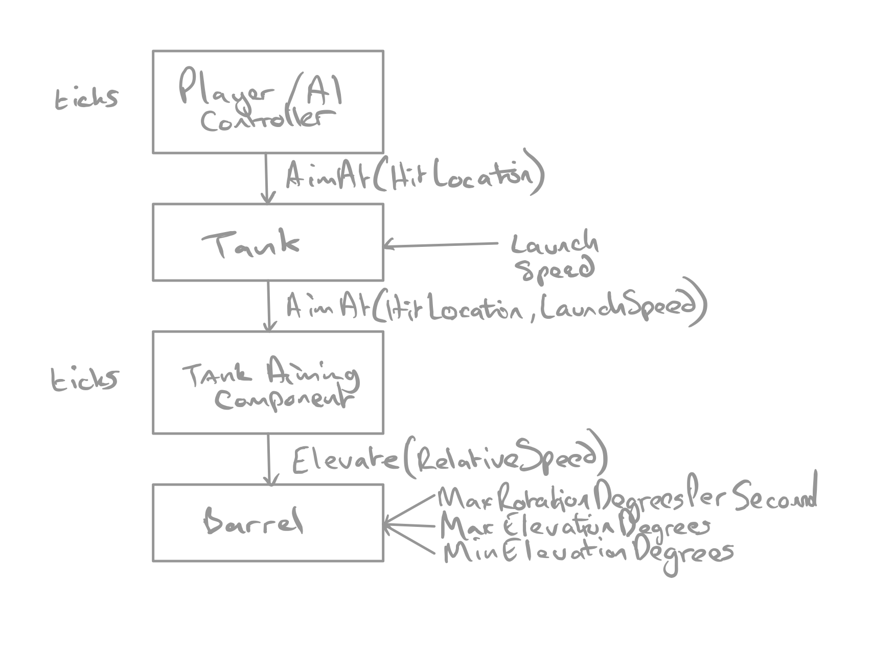

# Unreal Course

These are my notes about the C++ Unreal Course on Udemy:
https://www.udemy.com/course/unrealcourse/

## Using vim for editor

I'm going to try to use vim for my IDE but if it goes wrong I can move over to
QT Creator or vscode

## Other notes

* [vim-cpp-setup.md](vim-cpp-setup.md)

## Code Style

[learncpp.com](https://www.learncpp.com/cpp-tutorial/whitespace-and-basic-formatting/)
doesn't have a preference for tabs vs spaces but does prefer 1TB (One True
Brace) style for brackets.

### Coursework Repo

https://github.com/overbyte/unrealcourse/

UPDATE: this is deprecated in favour of separate repos for each project. I've
kept it for history


# Section 2 Triplex

[Coursework link](https://github.com/overbyte/unrealcourse-section-2-triplex)

## Compiling C++ on Linux

Pass the main file into `g++`

### Example

```
g++ main.cpp -o applicationname
```

**TODO**: We should probably create a `MakeFile` to simplify this process

#### Research

* https://www.gnu.org/software/make/manual/make.html
* https://courses.cs.washington.edu/courses/cse373/99au/unix/g++.html
* https://stackoverflow.com/questions/2481269/how-to-make-a-simple-c-makefile

# Section 3 BullCowGame

[Coursework link](https://github.com/overbyte/unrealcourse-section-3-bullcow)

## Notes

### using #includes

Note: including the class.h should happen at the bottom of the list of includes.

Example (in `Grabber.cpp`):
```
#include "DrawDebugHelpers.h"
#include "Engine/World.h"
#include "Grabber.h"
```

### const methods

const methods are methods which don't mutate member variables.

Example
```
void UBullCowGameCartridge::IsIsogram(FString Word) const
```

### Parameters vs Arguments

* Parameters are given in a method declaration
* Arguments are the values that are passed using the parameters

### Using References

When we use the following in our method declaration:

```
void UBullCowGameCartridge::MyMethod(FString Guess)
```
we are actually taking a copy of the Guess FString that is passed as an
argument. If we don't intend to do any local mutations to that variable, it is
more efficient to use a reference to the original variable. 

This is done with a & at the end of the type:
```
bool IsIsogram(const FString& Word) const;
```

It is preferable to make this a `const` because it would be a bad side effect to
mutate the original variable unless you want to use an out parameter

#### Using out parameters

To use an out parameter, we declare a variable outside the method, use a
non-const reference parameter and mutate the state of that variable from within
the method. 

Seems shady as balls - all side-effect.

Example:
```
int32 Bulls, Cows;
GetBullCows(Guess, Bulls, Cows);

void UBullCowCartridge::GetBullCows(const FString& Guess, int32& BullCount, int32& CowCount) 
{
    ...
```

### Defining structs

`struct`s can be defined in the header file outside the class

```
...
#include "BullCowCartridge.generated.h"

struct FBullCowCount
{
    int32 Bulls = 0;
    int32 Cows = 0;
};

UCLASS(ClassGroup=(Custom), meta=(BlueprintSpawnableComponent))
class BULLCOWGAME_API UBullCowCartridge : public UCartridge
{
    ...
```

Note: can be initialised and must be terminated with a ;


# Section 4 Building Escape

[Coursework link](https://github.com/overbyte/unrealcourse-section-4-building-escape)

### Using pointers

Pointers are variables that contain memory addresses that allow us to refer to
memory, potentially set up by another part of the application.

Pointers can be classes, structs or variables and members can be referenced with
either a dereference by adding a `*` to the pointer name and using brackets or
the arrow operator `->`.

Dereferencing allows us to treat the pointer as the object it references.

Dereference Example:
```
(*Brogrammer).StartCoding();
```

Arrow operator Example:
```
Brogrammer->StartCoding();
```

### Logging in UE4

Example:
```
UE_LOG(LogTemp, Warning, TEXT("This is a warning"));
UE_LOG(LogTemp, Warning, TEXT("Text, %d %f %s"), intVar, floatVar, *fstringVar);
```

Types:

* Error: Red
* Warning: Yellow
* Display: Grey

Template:

* `%d`: int
* `%i`: int
* `%f`: float
* `%s`: string - requires a pointer

### Naming

A good resource for naming
https://www.tomlooman.com/ue4-naming-convention/

From the course: https://web.archive.org/web/20181207033857/https://wiki.unrealengine.com/Assets_Naming_Convention
Opinionated naming conventions: https://github.com/Allar/ue4-style-guide

### Viewport

Button in top right of viewport will give quad view


### Modeling and Level Creation

#### Using Materials

* import a PNG
* right click and create material
* double click material to access material blueprint
* in content browser, right click material and create material instance to allow
  multiple scales etc

##### FFMPEG Conversion from TIF to PNG

```
ffmpeg -i TexturesCom_Wall_Cobblestone_3x3_1K_normal.tif cobblestone_normal_tex.png
```

#### Using BSP

By using the Geometry mode we can quickly rough in a bunch of shapes and items
for a level. 

Note: in the brush settings for each shape there is an additive and a
subtractive mode for each shape. Also note, by having a material selected when
the shapes are dragged out, they are automatically set.

The BSP can be converted to meshes under brush settings (may need to be
expanded)

#### Addiing code to objects

An object must be changed from a static mesh which bakes lighting and cannot be
dynamically moved to a `Moveable Object` which include dynamic lighting and can
be updated with code (See the door in the scene)

#### Fixing Player Collision and Visibility Collision view modes

Go to (top left of viewport) Show->Developer->Ray Tracing Debug

Player collision: shows collidable objects
Visibility Collision: shows visible collision (so in this mode, we can raycast
through a window, for example)

Colours:

* Pink: movable static mesh
* Cyan: static mesh
* Purple: stationary mesh
* Green: Trigger Volume
* Teal: Simulates Physics

#### Note About GetName()

There's a lot of use of `GetOwner()->GetName()` which is a weird case (currently
doesn't autocomplete in vim). 

Although `GetOwner()` returns a pointer to an `AActor` which does not have a
`GetName()` method, it actually comes from `UObjectBaseUtility`:
https://docs.unrealengine.com/en-US/API/Runtime/CoreUObject/UObject/UObjectBaseUtility/GetName/1/index.html

Forum Ref: https://community.gamedev.tv/t/aactor-getname/129972/2

#### Drawing debug lines

commit: https://github.com/overbyte/unrealcourse-section-4-building-escape/commit/a5d8d731cd772283276f1e1796215054c157d70e

Getting player viewpoint is very useful for first and third person games

we can also draw debug lines to show this

(Note Reach is a float to give the radius for the vector which will be 0-1 -
unit-based)

```
FVector PlayerViewPointPosition;
FRotator PlayerViewPointRotation;
GetWorld()->GetFirstPlayerController()->GetPlayerViewPoint(
    OUT PlayerViewPointPosition,
    OUT PlayerViewPointRotation
);

FVector LookAtPosition = PlayerViewPointPosition + (PlayerViewPointRotation.Vector() * Reach);

DrawDebugLine(
    GetWorld(),
    PlayerViewPointPosition,
    LookAtPosition,
    FColor(0, 255, 0),
    false,
    0.f,
    0,
    5.f
);
```

#### Raycast

To use a raycast collision, we can do the following

commit: https://github.com/overbyte/unrealcourse-section-4-building-escape/commit/a5d8d731cd772283276f1e1796215054c157d70e

```
// out param for raycast
FHitResult Hit;

// collision query params (no name, don't use complex collision, ignore this
// owner object
FCollisionQueryParams CollisionParams(
    FName(TEXT("")),
    false,
    GetOwner()
);

GetWorld()->LineTraceSingleByObjectType(
    OUT Hit,
    PlayerViewPointPosition,
    LookAtPosition,
    FCollisionObjectQueryParams(ECollisionChannel::ECC_PhysicsBody),
    CollisionParams
);
```

### Setting the default pawn

to change the player pawn, we need to:

* create new gamemode by creating a blueprint child of the GameModeBase C++
  class
* in the gamemode blueprint, set the default pawn class to a pawn blueprint

### pre-initialising classes / structs

Can use any of the following:
(note FRotator is a struct)

```
FRotator CurrentRotation;
CurrentRotation.Yaw = 90.f;
GetOwner()->SetActorRotation(CurrentRotation);
```

or
```
FRotator CurrentRotation{0.f, 90.f, 0.f};
GetOwner()->SetActorRotation(CurrentRotation);
```

or
```
FRotator CurrentRotation(0.f, 90.f, 0.f);
GetOwner()->SetActorRotation(CurrentRotation);
```

### Setting up collision on a mesh

There is simple collision which is always preferable but doesn't handle doorways
as they have holes in them. The collision should be set up in the model fbx but
if it isn't you can do any of the following (double click the mesh to open):

* Under Collision in the top menu, remove collision 
* In the detail panel under collision, use complex collision as simple will
  produce expensive collision
* Remove collision and create a new mesh from BSPs - remember to
  convert to mesh - Details Panel:Brush Settings:Create Static Mesh - and use
  complex collision as simple on this object instead.

really are better off getting an artist to do it in the model if poss

### Using Interpolation to animate

`FMath::Lerp(CurrentRotation, TargetRotation, Speed)` will allow per-frame
changes withing `AActor::TickComponent()`

to make this framerate agnostic, always multiply `Speed` by the `DeltaTime`
parameter.

Example:
```
CurrentYaw = FMath::Lerp(CurrentYaw, TargetYaw, DeltaTime * OpenSpeed);
FRotator DoorRotation = GetOwner()->GetActorRotation();
DoorRotation.Yaw = CurrentYaw;
GetOwner()->SetActorRotation(DoorRotation);
```

We can also use `FMath::FInterpTo(CurrentNum, TargetNum, DeltaTime, Speed)`
which includes this calculation as well. 

Example:

```
CurrentYaw = FMath::FInterpTo(CurrentYaw, TargetYaw, DeltaTime, OpenSpeed);
FRotator DoorRotation = GetOwner()->GetActorRotation();
DoorRotation.Yaw = CurrentYaw;
GetOwner()->SetActorRotation(DoorRotation);
```

# Section 7 BattleTank

## Landscape

A Landscape is made of a mesh of Quads, created in sections, in numbers of
Components

### Landscape Creation

Go to the Landscape tool to generate

* Scale will set the size of the quads in cm (x and y are the most important)
* Section Size sets the number of Quads in a section
* Number of Components sets the number of sections on an axis (x and y)
* Overall Resolution will give the total size of the Landscape

### Sculpting

Using the Landscape tool in sculpt mode, raise (or lower with shift) the ground.

* Sculpt: raise or lower terrain based on brush size and falloff (blur)
* smooth: normalise the terrain to smooth it out
* 

#### Importing a file to generate terrain

Export the existing terrain to a terrain map by going to the terrain tool, right
click on Height map and export.

We can import a grayscale file (created with terragen or similar) when the
Landscape is being created.

## Creating a Controllable Pawn Blueprint

The tank is created from 4 meshes which have an origin at the pivot point (or
the floor in the case of the tracks).

To create the blueprint, 
* create a new Pawn blueprint
* in the viewport add the tank body as a `static mesh`
* in the mesh object for the tank body add sockets for the turret and 2 tracks
  (note this is a weird set of instructions but gets around a bug in the editor):
  * add a socket (do not rename yet)
  * set the socket mesh to the turret
  * position the socket
  * clear the mesh from the socket
  * rename the socket to `Turret`
* add a turret as a child of the body mesh using the Turret socket
* set the socket to be the `Turret` socket
* repeat for the tracks
* in the Turret mesh add a socket for the barrel
If, once the child meshes are added with the sockets in the blueprint, they are
not in the expected place, set their xyz coordinates to 0 again.

We can simplify it a bit by setting the tank body to be the root element by
dragging it over the default.

To make physics apply to the element, in the blueprint, check the `simulate
physics` box and assign a weight in kg on the tank body (root element)
root element.

## Setting up input

* In `BP_Tank`
  * Create a new Event Graph called `InputBindingGraph`
* In project settings
  * in engine:input, add control called `AimAzimuth` - see
    [this](https://en.wikipedia.org/wiki/Azimuth) - it's the diameter of the
    sphere that we're moving the camera in (note: it's yaw for mapping purposes)
    * add x axis mouse input 
    * add right-stick-x axis
  * do the same for `AimElevation` on the y axis
* add blueprint

  * notes
    * this multiplies the spring arm azimuth by world delta seconds and 100 and
      pipes it into the yaw
    * this multiplies the spring arm elevation by world delta seconds and 100 and
      pipes it into the pitch
* to stop the rotation to start rolling when the camera is both pitched and
  yawed add a `scene` component to use as a gimbal to use for azimuth rotation
  and parent it to tank (named `AzimuthElevation`)
  * make the spring arm a child of this
  * the gimbal is the camera target - translate z by 150 cm to target the tank
    top or it will end up on the floor
  * reset the position and rotation of the spring arm and camera so the camera
    ends up on the end of the spring arm (marked in red)
  * increase the length of the spring arm to push the camera away and rotate the
    spring arm to elevate the camera
  * update the blueprint to make the scene input elevation use the gimbal as the
    target
* to stop the camera from rolling when the tank is at an angle (ie on a slope),
  on the springarm, uncheck the `inherit roll` box

## Adding player UI

* create a 'user interface:widget blueprint'
* add an image to the interface 
  * move the anchor from the center to where the image should be on the screen -
    this is a ratio to make it relative to screen resolution
  * reset the position x and y numbers
  * set the size x and y
  * set the alignment to x=0.5, y=0.5 to center the image on the anchor
* create a `Player Controller` blueprint and add 
  * create ui widget
  * add to viewport

* update the player controller section of the BattleTank Game Mode

Notes:

* for a main menu level, we can use the level blueprint instead of using the
  player controller blueprint
* for main menus, if we want a background image that scales to fill, we add a
  scale box component and make the image a child of it
  * set the anchors of the scale box to fill the screen
  * set the offsets to 0
  * reset the size of the image so it scales correctly
* to turn on the mouse (eg for a menu), in the level blueprint for the main
  menu
  * get the player controller
  * set the mouse cursor (click the checkbox)
  * attache the mouse cursor to the end of the add to viewport


### Enabling the start button

from the `BP_MainMenuUI` Event Graph

* use the `on button clicked` button on the button in the designer panel
* from the new event use `Open Level` and add the name of the gameplay level

### Adding controller support to start page

* create a widget ready custom event at the end of the chain in the `MainMenu`
  level blueprint


* update the `BP_MainMenuUI` with a listener for the widget ready event
* set the input mode ui only to the start button
* once the level is open, set it back to game mode only


### Adding fonts

Download the .ttf and import it to the project.

* version used is [Series Orbit](https://www.dafont.com/seriesorbit.font?l[]=10&l[]=1)

### Blueprint parent classes

We can reparent a blueprint class by

* taking note of its superclass in the top right of the blueprint graph editor
  screen
* create new C++ class of the same type
* select the new C++ class from the blueprint `Class Settings`

## C++ Polymorphism

demo can be found at https://github.com/overbyte/unrealcourse-7a-polymorphism-demo
along with notes

## posessing the tank with an AI controller

* create new C++ class and select `show all classes` to select the AIController
  and create `TankAIController`
* in the `BP_Tank`
  * make sure `Auto Possess` is off
  * make sure `Auto Possess AI` is set to `Placed in the world`
  * set the AI Controller class to new `TankAIController`

## Example raycast by channel

The Player Controller includes a raycast to look at a point indicated in the UI
with a dot (called the crosshair)

https://github.com/overbyte/unrealcourse-section-7-tank-battle/blob/master/BattleTank/Source/BattleTank/Private/TankPlayerController.cpp

```

bool ATankPlayerController::GetLookVectorHitLocation(const FVector &LookDirection, FVector &OutHitLocation) const
{
    FCollisionQueryParams CollisionParams(
            FName(TEXT("")),
            false,
            GetPawn()
        );

    FHitResult OutHitResult;

    FVector StartLocation = PlayerCameraManager->GetCameraLocation();
    FVector EndLocation = StartLocation + LookDirection * ProjectileRange;

    if (GetWorld()->LineTraceSingleByChannel(
            OutHitResult,
            StartLocation,
            EndLocation,
            ECollisionChannel::ECC_Visibility,
            CollisionParams,
            FCollisionResponseParams(ECollisionResponse::ECR_Block)
        )
    )
    {
        OutHitLocation = OutHitResult.Location;
        return true;
    }

    OutHitLocation = FVector(0.f);
    return false;
}

```
notes
* `OutHitLocation` is an out paramter (that is a reference to state that is
  mutated as a side effect of this method. Icky but all over Unreal probably
  because the scope holds the memory
* The `GetLookDirection` method de-projects the point indicated by the UI to a
  world position
* `ScreenLocation` should probably be renamed to something like
  `CrosshairLocation2D` to be more descriptive
* `FCollisionQueryParams` adds `GetPawn()` (instead of `GetOwner()`) to be
  ignored when considering the ray cast collision
* `ECollisionResponse::ECR_Block` is a guess and should probably be removed to
  allow the default to go in - the [docs](https://docs.unrealengine.com/en-US/API/Runtime/Engine/Engine/ECollisionResponse/index.html)
  are frustratingly non-descriptive

## The C++ Compilation

It is prefereable to include header files for other classes in the cpp file but
not in the header file for a class. This is to avoid dependency problems later
on. It does mean, however that the headers should be added int he order they're
required.

### Forward declarations

We can get around the need to use one of our class header files in another
header file by using a forward declaration. We need to declare the class in the
header file that depends on it. We will then redeclare it in the actual header /
implementation file

Example: `TankAimingComponent.h` re: `TankBarrel`

```
  7 #include "TankAimingComponent.generated.h"
  8
 11 class UTankBarrel;
 12
 13 UCLASS( ClassGroup=(Custom), meta=(BlueprintSpawnableComponent) )
 14 class BATTLETANK_API UTankAimingComponent : public UActorComponent
 15 {
 16     GENERATED_BODY()
 17
 25 private:
 26     UTankBarrel* Barrel = nullptr;
```

## making component blueprint spawnable

in the header file, add the following to the UCLASS declaration
```
UCLASS(meta = (BlueprintSpawnableComponent))
```

This will allow the C++ component to be able to be used in a blueprint (will
appear in the components list to be dragged to the blueprint)

Drag this as a child of the turret, add it to the event graph (blueprint) and
hook it up to the `Set Barrel Reference` (which expects an object of type,
`TankBarrel`) node to fix the errors

To give some useful information, add a comment before the UCLASS declaration -
this will be available in the tooltip

Some other interesting options:

##### Remove categories from blueprint (to stop designer misusing them)

Example: remove the collision section from a component
```
UCLASS(meta = (BlueprintSpawnableComponent), hidecategories = ("Collision"))
```

## How the barrel elevates



Commits:
* https://github.com/overbyte/unrealcourse-section-7-tank-battle/commit/3bd5504644d9f6351e336a8d5258e143eace96a2

## Rotating the turret

Very similar to elevating the barrel 

Commits:
* https://github.com/overbyte/unrealcourse-section-7-tank-battle/commit/484bb1e817d40143aab65775507829a0837b23ed
